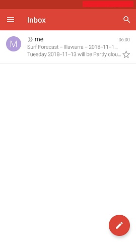

```{r setup, include=FALSE}
knitr::opts_chunk$set(echo = TRUE)
```

## Problem  

A non-R related pursuit of mine is surf photography, which is highly weather dependent. Often 
existing weather forecasts aren't the best fit for my specific use. 


## Solution  

A fun project to combine some cool R tools would be an automated surf forecast email
that fires at 6am every morning. Ideally it should be as concise as possible, with the key
info I need and a good synoptic weather image. 

Key steps required:

1. Obtain Forecast data  
2. Make it human readable  
3. Send it via email  
4. Automate it
  
  
### Obtain Forecast data   

Earlier this year I made some contributions to the [`bomrang`](https://ropensci.github.io/bomrang/) R package.  

`bomrang` provides functions to interface with Australian Government Bureau of Meteorology (BOM) data, fetching data and returning a tidy data frame of précis forecasts, current weather data from stations, ag information bulletins, historical weather data and downloading and importing radar or satellite imagery. `bomrang` is part of the [rOpenSci](https://ropensci.org/) project and has a fantastic team of authors and contributors.  

Given my focus is on coastal and surf forecasts I used the `get_coastal_forecast()` function (which I developed).  

```{r echo=TRUE, message=FALSE, warning=FALSE}
library(bomrang) 
library(dplyr)
forecast <- bomrang::get_coastal_forecast(state = "NSW") %>% filter(dist_name == "Illawarra")
forecast[,c(4, 5, 9, 14, 15)] %>% knitr::kable()
```


### Make it human readable   

The outputs from the `bomrang` coastal forecast are in the form of a data frame. To make it easier to digest I wanted to pull out key components and turn it into a short paragraph. To do this I used the [`glue`](https://glue.tidyverse.org/) package.  One really useful feature of `glue` is its ability to vectorise the gluing of strings. Given my forecast data typically has multi-day forecasts, the one `glue()` function is able to handle this nicely.  


```{r echo=TRUE, message=FALSE, warning=FALSE}
glue::glue("

{lubridate::wday(forecast$start_time_local, label = TRUE, abbr = FALSE)} {as.Date(forecast$start_time_local, tz = 'Australia/Sydney')} will be {forecast$forecast_weather}
The swell is {forecast$forecast_swell1} 

")
```


### Send via email  

Once I retrieve and format my custom forecast, emailing it to myself was essential so I could read it on my
phone each morning. The [`gmailr`](https://github.com/jimhester/gmailr) package was an easy way to do this. I followed the steps to setup a Google Project which was covered really well in the project README. From there it was straightforward. 

One custom feature I wanted was the inclusion of a synoptic weather map so I could see cold fronts rolling their way up the coast from Antarctica.  

Given my aim was to automate this process I was able to use the `gmailr::use_secret_file()` function to retrieve my client and secret key from a local .json file. 

```{r eval=FALSE, include=TRUE}
# Download Weather Map ----------------------------------------------------

tf <- tempfile(fileext = ".gif")
download.file(url = synoptic_img, destfile = tf, mode = "wb")


# Send Mail ---------------------------------------------------------------
msg <- gmailr::mime() %>%
  gmailr::subject(subject) %>% 
  gmailr::to(to) %>%
  gmailr::from(from) %>% 
  gmailr::text_body(body) %>% 
  gmailr::attach_part(body) %>% 
  gmailr::attach_file(tf)

gmailr::send_message(msg)
```


### Automate it  

This combination of tools works great locally, however for convenience I wanted it to automatically email me at
6am every morning so I could see if it was worth getting out of bed.  

One option was to set up an [AWS EC2](https://aws.amazon.com/ec2/) virtual server. 

I cover the basic setup of this in a [previous post](https://deanmarchiori.github.io/posts/2018/07/rstudio-aws/). The final step is to automate this R script using a cronjob (given we are using linux). 

To do this I open the crontab in the terminal

```{}
crontab -e
```

and add a line to the bottom file with the particulars of the job scheduling:  

```{}
   # Use the hash sign to prefix a comment
    # +---------------- minute (0 - 59)
    # |  +------------- hour (0 - 23)
    # |  |  +---------- day of month (1 - 31)
    # |  |  |  +------- month (1 - 12)
    # |  |  |  |  +---- day of week (0 - 7) (Sunday=0 or 7)
    # |  |  |  |  |
    # *  *  *  *  *  command to be executed
```

Below we can see a cronjob to run at minute 0, hour 6, every day, every month.  

The command changes directory to where the rscript is saved and then `Rscript`
to run the code. 

```{}
0 6 * * * cd folder_containing_script && Rscript r_file.R
```

and we're done.




## Links  

[AWS EC2](https://aws.amazon.com/ec2/)  
[Installing RStudio Server on AWS](https://deanmarchiori.github.io/posts/2018/07/rstudio-aws/)  
[gmailr](https://github.com/jimhester/gmailr)   
[glue](https://glue.tidyverse.org/)  
[bomrang](https://ropensci.github.io/bomrang/)    
[rOpenSci](https://ropensci.org/)   

